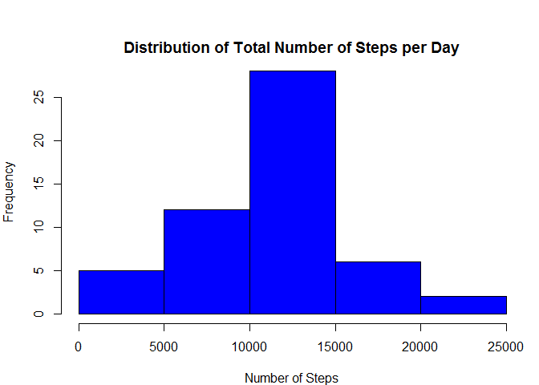
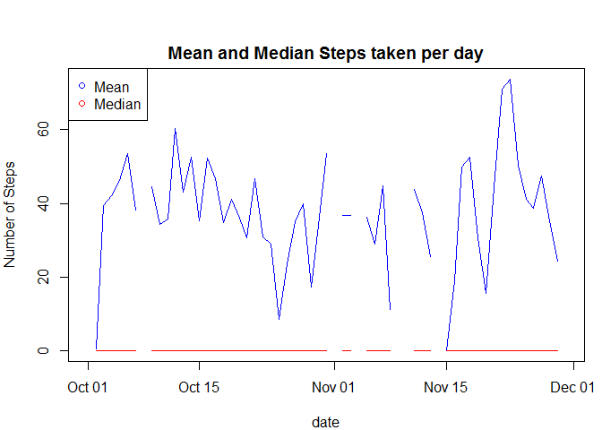
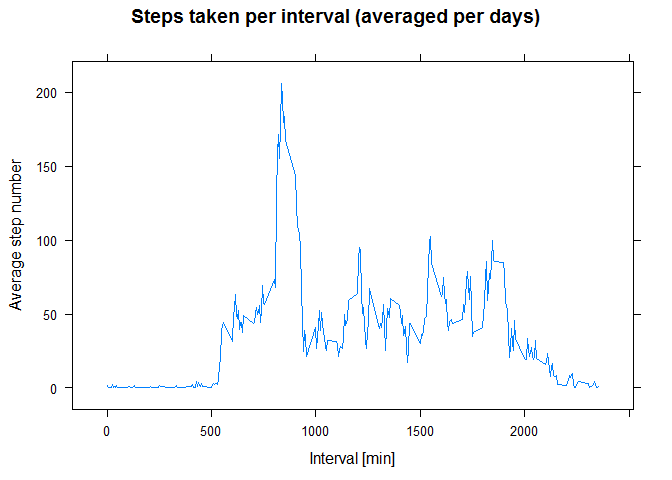
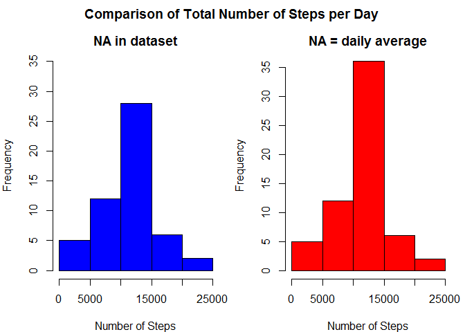
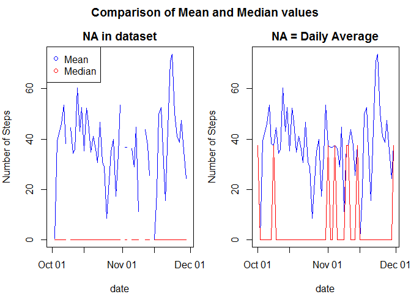

# Reproducible Research: Peer Assessment 1

It is now possible to collect a large amount of data about personal movement using activity monitoring devices such as a Fitbit, Nike Fuelband, or Jawbone Up. These type of devices are part of the "quantified self" movement - a group of enthusiasts who take measurements about themselves regularly to improve their health, to find patterns in their behavior, or because they are tech geeks. But these data remain under-utilized both because the raw data are hard to obtain and there is a lack of statistical methods and software for processing and interpreting the data.

This assignment makes use of data from a personal activity monitoring device. This device collects data at 5 minute intervals through out the day. The data consists of two months of data from an anonymous individual collected during the months of October and November, 2012 and include the number of steps taken in 5 minute intervals each day.

## Loading and preprocessing the data

First of all, let's load the libraries used in this project


```r
library(dplyr)
```

```
## 
## Attaching package: 'dplyr'
## 
## The following objects are masked from 'package:stats':
## 
##     filter, lag
## 
## The following objects are masked from 'package:base':
## 
##     intersect, setdiff, setequal, union
```

```r
library(xtable)
```

```
## Warning: package 'xtable' was built under R version 3.2.2
```

```r
library(lattice)
```

Then we download and read the dataset 


```r
url <- "https://d396qusza40orc.cloudfront.net/repdata%2Fdata%2Factivity.zip"
temp <- tempfile()
download.file(url,temp, method = "libcurl")
data <- read.csv(unz(temp,  unzip(temp, list = TRUE)[1,1]), header = TRUE)
```

We convert the "date" variable into the appropriate class


```r
Sys.setlocale("LC_TIME", "C");
data$date <- as.Date(data$date, "%Y-%m-%d")
```

## What is mean total number of steps taken per day?

We produce a dataset containing the total, mean, and median of the variable "step" taken per day


```r
data <- group_by(data, date)
data_mean <- summarise(data, mean_steps = mean(steps))
data_med <- summarise(data, median_steps = median(steps, na.rm = TRUE))
data_sum <- summarise(data, total_steps = sum(steps)) %>%
        bind_cols(data_mean[,2]) %>%
        bind_cols(data_med[,2])
rm(data_mean)
rm(data_med)
```

Now we display the distribution of the total number of steps taken each day


```r
par(mfrow = c(1,1), mar = c(4, 4, 2, 1), oma = c(0, 0, 2, 0))  
hist(data_sum$total_steps, xlab = "Number of Steps", main = "Distribution of Total Number of Steps per Day", col = "Blue")
```

 

And here we display the mean and the median


```r
t <- data_sum
t$date <- as.character(t$date)
xt <- xtable(t, caption = "Daily total, mean and median steps")
print(xt, type = "html")
```

<!-- html table generated in R 3.2.1 by xtable 1.7-4 package -->
<!-- Fri Oct 16 17:12:29 2015 -->
<table border=1>
<caption align="bottom"> Daily total, mean and median steps </caption>
<tr> <th>  </th> <th> date </th> <th> total_steps </th> <th> mean_steps </th> <th> median_steps </th>  </tr>
  <tr> <td align="right"> 1 </td> <td> 2012-10-01 </td> <td align="right">  </td> <td align="right">  </td> <td align="right">  </td> </tr>
  <tr> <td align="right"> 2 </td> <td> 2012-10-02 </td> <td align="right"> 126 </td> <td align="right"> 0.44 </td> <td align="right"> 0.00 </td> </tr>
  <tr> <td align="right"> 3 </td> <td> 2012-10-03 </td> <td align="right"> 11352 </td> <td align="right"> 39.42 </td> <td align="right"> 0.00 </td> </tr>
  <tr> <td align="right"> 4 </td> <td> 2012-10-04 </td> <td align="right"> 12116 </td> <td align="right"> 42.07 </td> <td align="right"> 0.00 </td> </tr>
  <tr> <td align="right"> 5 </td> <td> 2012-10-05 </td> <td align="right"> 13294 </td> <td align="right"> 46.16 </td> <td align="right"> 0.00 </td> </tr>
  <tr> <td align="right"> 6 </td> <td> 2012-10-06 </td> <td align="right"> 15420 </td> <td align="right"> 53.54 </td> <td align="right"> 0.00 </td> </tr>
  <tr> <td align="right"> 7 </td> <td> 2012-10-07 </td> <td align="right"> 11015 </td> <td align="right"> 38.25 </td> <td align="right"> 0.00 </td> </tr>
  <tr> <td align="right"> 8 </td> <td> 2012-10-08 </td> <td align="right">  </td> <td align="right">  </td> <td align="right">  </td> </tr>
  <tr> <td align="right"> 9 </td> <td> 2012-10-09 </td> <td align="right"> 12811 </td> <td align="right"> 44.48 </td> <td align="right"> 0.00 </td> </tr>
  <tr> <td align="right"> 10 </td> <td> 2012-10-10 </td> <td align="right"> 9900 </td> <td align="right"> 34.38 </td> <td align="right"> 0.00 </td> </tr>
  <tr> <td align="right"> 11 </td> <td> 2012-10-11 </td> <td align="right"> 10304 </td> <td align="right"> 35.78 </td> <td align="right"> 0.00 </td> </tr>
  <tr> <td align="right"> 12 </td> <td> 2012-10-12 </td> <td align="right"> 17382 </td> <td align="right"> 60.35 </td> <td align="right"> 0.00 </td> </tr>
  <tr> <td align="right"> 13 </td> <td> 2012-10-13 </td> <td align="right"> 12426 </td> <td align="right"> 43.15 </td> <td align="right"> 0.00 </td> </tr>
  <tr> <td align="right"> 14 </td> <td> 2012-10-14 </td> <td align="right"> 15098 </td> <td align="right"> 52.42 </td> <td align="right"> 0.00 </td> </tr>
  <tr> <td align="right"> 15 </td> <td> 2012-10-15 </td> <td align="right"> 10139 </td> <td align="right"> 35.20 </td> <td align="right"> 0.00 </td> </tr>
  <tr> <td align="right"> 16 </td> <td> 2012-10-16 </td> <td align="right"> 15084 </td> <td align="right"> 52.38 </td> <td align="right"> 0.00 </td> </tr>
  <tr> <td align="right"> 17 </td> <td> 2012-10-17 </td> <td align="right"> 13452 </td> <td align="right"> 46.71 </td> <td align="right"> 0.00 </td> </tr>
  <tr> <td align="right"> 18 </td> <td> 2012-10-18 </td> <td align="right"> 10056 </td> <td align="right"> 34.92 </td> <td align="right"> 0.00 </td> </tr>
  <tr> <td align="right"> 19 </td> <td> 2012-10-19 </td> <td align="right"> 11829 </td> <td align="right"> 41.07 </td> <td align="right"> 0.00 </td> </tr>
  <tr> <td align="right"> 20 </td> <td> 2012-10-20 </td> <td align="right"> 10395 </td> <td align="right"> 36.09 </td> <td align="right"> 0.00 </td> </tr>
  <tr> <td align="right"> 21 </td> <td> 2012-10-21 </td> <td align="right"> 8821 </td> <td align="right"> 30.63 </td> <td align="right"> 0.00 </td> </tr>
  <tr> <td align="right"> 22 </td> <td> 2012-10-22 </td> <td align="right"> 13460 </td> <td align="right"> 46.74 </td> <td align="right"> 0.00 </td> </tr>
  <tr> <td align="right"> 23 </td> <td> 2012-10-23 </td> <td align="right"> 8918 </td> <td align="right"> 30.97 </td> <td align="right"> 0.00 </td> </tr>
  <tr> <td align="right"> 24 </td> <td> 2012-10-24 </td> <td align="right"> 8355 </td> <td align="right"> 29.01 </td> <td align="right"> 0.00 </td> </tr>
  <tr> <td align="right"> 25 </td> <td> 2012-10-25 </td> <td align="right"> 2492 </td> <td align="right"> 8.65 </td> <td align="right"> 0.00 </td> </tr>
  <tr> <td align="right"> 26 </td> <td> 2012-10-26 </td> <td align="right"> 6778 </td> <td align="right"> 23.53 </td> <td align="right"> 0.00 </td> </tr>
  <tr> <td align="right"> 27 </td> <td> 2012-10-27 </td> <td align="right"> 10119 </td> <td align="right"> 35.14 </td> <td align="right"> 0.00 </td> </tr>
  <tr> <td align="right"> 28 </td> <td> 2012-10-28 </td> <td align="right"> 11458 </td> <td align="right"> 39.78 </td> <td align="right"> 0.00 </td> </tr>
  <tr> <td align="right"> 29 </td> <td> 2012-10-29 </td> <td align="right"> 5018 </td> <td align="right"> 17.42 </td> <td align="right"> 0.00 </td> </tr>
  <tr> <td align="right"> 30 </td> <td> 2012-10-30 </td> <td align="right"> 9819 </td> <td align="right"> 34.09 </td> <td align="right"> 0.00 </td> </tr>
  <tr> <td align="right"> 31 </td> <td> 2012-10-31 </td> <td align="right"> 15414 </td> <td align="right"> 53.52 </td> <td align="right"> 0.00 </td> </tr>
  <tr> <td align="right"> 32 </td> <td> 2012-11-01 </td> <td align="right">  </td> <td align="right">  </td> <td align="right">  </td> </tr>
  <tr> <td align="right"> 33 </td> <td> 2012-11-02 </td> <td align="right"> 10600 </td> <td align="right"> 36.81 </td> <td align="right"> 0.00 </td> </tr>
  <tr> <td align="right"> 34 </td> <td> 2012-11-03 </td> <td align="right"> 10571 </td> <td align="right"> 36.70 </td> <td align="right"> 0.00 </td> </tr>
  <tr> <td align="right"> 35 </td> <td> 2012-11-04 </td> <td align="right">  </td> <td align="right">  </td> <td align="right">  </td> </tr>
  <tr> <td align="right"> 36 </td> <td> 2012-11-05 </td> <td align="right"> 10439 </td> <td align="right"> 36.25 </td> <td align="right"> 0.00 </td> </tr>
  <tr> <td align="right"> 37 </td> <td> 2012-11-06 </td> <td align="right"> 8334 </td> <td align="right"> 28.94 </td> <td align="right"> 0.00 </td> </tr>
  <tr> <td align="right"> 38 </td> <td> 2012-11-07 </td> <td align="right"> 12883 </td> <td align="right"> 44.73 </td> <td align="right"> 0.00 </td> </tr>
  <tr> <td align="right"> 39 </td> <td> 2012-11-08 </td> <td align="right"> 3219 </td> <td align="right"> 11.18 </td> <td align="right"> 0.00 </td> </tr>
  <tr> <td align="right"> 40 </td> <td> 2012-11-09 </td> <td align="right">  </td> <td align="right">  </td> <td align="right">  </td> </tr>
  <tr> <td align="right"> 41 </td> <td> 2012-11-10 </td> <td align="right">  </td> <td align="right">  </td> <td align="right">  </td> </tr>
  <tr> <td align="right"> 42 </td> <td> 2012-11-11 </td> <td align="right"> 12608 </td> <td align="right"> 43.78 </td> <td align="right"> 0.00 </td> </tr>
  <tr> <td align="right"> 43 </td> <td> 2012-11-12 </td> <td align="right"> 10765 </td> <td align="right"> 37.38 </td> <td align="right"> 0.00 </td> </tr>
  <tr> <td align="right"> 44 </td> <td> 2012-11-13 </td> <td align="right"> 7336 </td> <td align="right"> 25.47 </td> <td align="right"> 0.00 </td> </tr>
  <tr> <td align="right"> 45 </td> <td> 2012-11-14 </td> <td align="right">  </td> <td align="right">  </td> <td align="right">  </td> </tr>
  <tr> <td align="right"> 46 </td> <td> 2012-11-15 </td> <td align="right">  41 </td> <td align="right"> 0.14 </td> <td align="right"> 0.00 </td> </tr>
  <tr> <td align="right"> 47 </td> <td> 2012-11-16 </td> <td align="right"> 5441 </td> <td align="right"> 18.89 </td> <td align="right"> 0.00 </td> </tr>
  <tr> <td align="right"> 48 </td> <td> 2012-11-17 </td> <td align="right"> 14339 </td> <td align="right"> 49.79 </td> <td align="right"> 0.00 </td> </tr>
  <tr> <td align="right"> 49 </td> <td> 2012-11-18 </td> <td align="right"> 15110 </td> <td align="right"> 52.47 </td> <td align="right"> 0.00 </td> </tr>
  <tr> <td align="right"> 50 </td> <td> 2012-11-19 </td> <td align="right"> 8841 </td> <td align="right"> 30.70 </td> <td align="right"> 0.00 </td> </tr>
  <tr> <td align="right"> 51 </td> <td> 2012-11-20 </td> <td align="right"> 4472 </td> <td align="right"> 15.53 </td> <td align="right"> 0.00 </td> </tr>
  <tr> <td align="right"> 52 </td> <td> 2012-11-21 </td> <td align="right"> 12787 </td> <td align="right"> 44.40 </td> <td align="right"> 0.00 </td> </tr>
  <tr> <td align="right"> 53 </td> <td> 2012-11-22 </td> <td align="right"> 20427 </td> <td align="right"> 70.93 </td> <td align="right"> 0.00 </td> </tr>
  <tr> <td align="right"> 54 </td> <td> 2012-11-23 </td> <td align="right"> 21194 </td> <td align="right"> 73.59 </td> <td align="right"> 0.00 </td> </tr>
  <tr> <td align="right"> 55 </td> <td> 2012-11-24 </td> <td align="right"> 14478 </td> <td align="right"> 50.27 </td> <td align="right"> 0.00 </td> </tr>
  <tr> <td align="right"> 56 </td> <td> 2012-11-25 </td> <td align="right"> 11834 </td> <td align="right"> 41.09 </td> <td align="right"> 0.00 </td> </tr>
  <tr> <td align="right"> 57 </td> <td> 2012-11-26 </td> <td align="right"> 11162 </td> <td align="right"> 38.76 </td> <td align="right"> 0.00 </td> </tr>
  <tr> <td align="right"> 58 </td> <td> 2012-11-27 </td> <td align="right"> 13646 </td> <td align="right"> 47.38 </td> <td align="right"> 0.00 </td> </tr>
  <tr> <td align="right"> 59 </td> <td> 2012-11-28 </td> <td align="right"> 10183 </td> <td align="right"> 35.36 </td> <td align="right"> 0.00 </td> </tr>
  <tr> <td align="right"> 60 </td> <td> 2012-11-29 </td> <td align="right"> 7047 </td> <td align="right"> 24.47 </td> <td align="right"> 0.00 </td> </tr>
  <tr> <td align="right"> 61 </td> <td> 2012-11-30 </td> <td align="right">  </td> <td align="right">  </td> <td align="right">  </td> </tr>
   </table>


```r
par(mar = c(4, 4, 2, 1), oma = c(0, 0, 2, 0))
with(data_sum, plot(date, mean_steps, type = "l", main = "Mean and Median Steps taken per day", ylab = "Number of Steps", col = "Blue"))
with(data_sum, lines(date, median_steps, col = "Red"))
legend("topleft", pch = 1, col = c("blue", "red"), legend = c("Mean", "Median"))
```

 


## What is the average daily activity pattern?


```r
data <- group_by(data, interval) %>% arrange(interval)
trend <- summarise(data, mean_steps = mean(steps, na.rm = TRUE))
xyplot (mean_steps ~ interval, data = trend, type = "l", xlab = "Interval [min]", ylab="Average step number", main="Steps taken per interval (averaged per days)")
```

 

This is the 5-minute interval that, on average, contains the maximum number of steps


```r
trend[trend$mean_step == max(trend$mean_steps), ]
```

```
## Source: local data frame [1 x 2]
## 
##   interval mean_steps
## 1      835   206.1698
```


## Imputing missing values

Here we create a clone dataset and substitute the NA values in the "step" variable with the corresponding daily average


```r
ungroup(data)
data2 <- data
table(is.na(data2$steps))
for (i in 1:nrow(data2)) {
        if (is.na(data2[i, "steps"]) == TRUE) {
                date <- data2[i, "date"]
                a <- mean(subset(data2, data2$date == date)$steps, na.rm = TRUE)
                data2[i, "steps"] <- a
        }
}
round(data2$steps)
```

Then we calculate the total, mean, and median of the variable "step" taken per day 


```r
data2 <- group_by(data2, date)
data2_mean <- summarise(data2, mean_steps = mean(steps, na.rm = TRUE))
data2_med <- summarise(data2, median_steps = median(steps, na.rm = TRUE))
data2_sum <- summarise(data2, total_steps = sum(steps, na.rm = TRUE)) %>%
        bind_cols(data2_mean[,2]) %>%
        bind_cols(data2_med[,2])
rm(data2_mean)
rm(data2_med)
```

Now we compare how imputing the missing values affect the distribution of the total number of steps taken each day


```r
par(mfrow = c(1,2), mar = c(4, 4, 2, 1), oma = c(0, 0, 2, 0))
hist(data_sum$total_steps, xlab = "Number of Steps", main = "NA in dataset", col = "Blue", ylim = c(0, 35))
hist(data2_sum$total_steps, xlab = "Number of Steps", main = "NA = daily average", col = "Red")
title("Comparison of Total Number of Steps per Day", outer = TRUE)
```

 

And also how it affects the mean and median values 


```r
t2 <- data2_sum
t2$date <- as.character(t2$date)
xt2 <- xtable(t2, caption = "Daily total, mean and median steps")
print(xt2, type = "html")
```

<!-- html table generated in R 3.2.1 by xtable 1.7-4 package -->
<!-- Fri Oct 16 17:12:41 2015 -->
<table border=1>
<caption align="bottom"> Daily total, mean and median steps </caption>
<tr> <th>  </th> <th> date </th> <th> total_steps </th> <th> mean_steps </th> <th> median_steps </th>  </tr>
  <tr> <td align="right"> 1 </td> <td> 2012-10-01 </td> <td align="right"> 10766.19 </td> <td align="right"> 37.38 </td> <td align="right"> 37.38 </td> </tr>
  <tr> <td align="right"> 2 </td> <td> 2012-10-02 </td> <td align="right"> 126.00 </td> <td align="right"> 0.44 </td> <td align="right"> 0.00 </td> </tr>
  <tr> <td align="right"> 3 </td> <td> 2012-10-03 </td> <td align="right"> 11352.00 </td> <td align="right"> 39.42 </td> <td align="right"> 0.00 </td> </tr>
  <tr> <td align="right"> 4 </td> <td> 2012-10-04 </td> <td align="right"> 12116.00 </td> <td align="right"> 42.07 </td> <td align="right"> 0.00 </td> </tr>
  <tr> <td align="right"> 5 </td> <td> 2012-10-05 </td> <td align="right"> 13294.00 </td> <td align="right"> 46.16 </td> <td align="right"> 0.00 </td> </tr>
  <tr> <td align="right"> 6 </td> <td> 2012-10-06 </td> <td align="right"> 15420.00 </td> <td align="right"> 53.54 </td> <td align="right"> 0.00 </td> </tr>
  <tr> <td align="right"> 7 </td> <td> 2012-10-07 </td> <td align="right"> 11015.00 </td> <td align="right"> 38.25 </td> <td align="right"> 0.00 </td> </tr>
  <tr> <td align="right"> 8 </td> <td> 2012-10-08 </td> <td align="right"> 10766.19 </td> <td align="right"> 37.38 </td> <td align="right"> 37.38 </td> </tr>
  <tr> <td align="right"> 9 </td> <td> 2012-10-09 </td> <td align="right"> 12811.00 </td> <td align="right"> 44.48 </td> <td align="right"> 0.00 </td> </tr>
  <tr> <td align="right"> 10 </td> <td> 2012-10-10 </td> <td align="right"> 9900.00 </td> <td align="right"> 34.38 </td> <td align="right"> 0.00 </td> </tr>
  <tr> <td align="right"> 11 </td> <td> 2012-10-11 </td> <td align="right"> 10304.00 </td> <td align="right"> 35.78 </td> <td align="right"> 0.00 </td> </tr>
  <tr> <td align="right"> 12 </td> <td> 2012-10-12 </td> <td align="right"> 17382.00 </td> <td align="right"> 60.35 </td> <td align="right"> 0.00 </td> </tr>
  <tr> <td align="right"> 13 </td> <td> 2012-10-13 </td> <td align="right"> 12426.00 </td> <td align="right"> 43.15 </td> <td align="right"> 0.00 </td> </tr>
  <tr> <td align="right"> 14 </td> <td> 2012-10-14 </td> <td align="right"> 15098.00 </td> <td align="right"> 52.42 </td> <td align="right"> 0.00 </td> </tr>
  <tr> <td align="right"> 15 </td> <td> 2012-10-15 </td> <td align="right"> 10139.00 </td> <td align="right"> 35.20 </td> <td align="right"> 0.00 </td> </tr>
  <tr> <td align="right"> 16 </td> <td> 2012-10-16 </td> <td align="right"> 15084.00 </td> <td align="right"> 52.38 </td> <td align="right"> 0.00 </td> </tr>
  <tr> <td align="right"> 17 </td> <td> 2012-10-17 </td> <td align="right"> 13452.00 </td> <td align="right"> 46.71 </td> <td align="right"> 0.00 </td> </tr>
  <tr> <td align="right"> 18 </td> <td> 2012-10-18 </td> <td align="right"> 10056.00 </td> <td align="right"> 34.92 </td> <td align="right"> 0.00 </td> </tr>
  <tr> <td align="right"> 19 </td> <td> 2012-10-19 </td> <td align="right"> 11829.00 </td> <td align="right"> 41.07 </td> <td align="right"> 0.00 </td> </tr>
  <tr> <td align="right"> 20 </td> <td> 2012-10-20 </td> <td align="right"> 10395.00 </td> <td align="right"> 36.09 </td> <td align="right"> 0.00 </td> </tr>
  <tr> <td align="right"> 21 </td> <td> 2012-10-21 </td> <td align="right"> 8821.00 </td> <td align="right"> 30.63 </td> <td align="right"> 0.00 </td> </tr>
  <tr> <td align="right"> 22 </td> <td> 2012-10-22 </td> <td align="right"> 13460.00 </td> <td align="right"> 46.74 </td> <td align="right"> 0.00 </td> </tr>
  <tr> <td align="right"> 23 </td> <td> 2012-10-23 </td> <td align="right"> 8918.00 </td> <td align="right"> 30.97 </td> <td align="right"> 0.00 </td> </tr>
  <tr> <td align="right"> 24 </td> <td> 2012-10-24 </td> <td align="right"> 8355.00 </td> <td align="right"> 29.01 </td> <td align="right"> 0.00 </td> </tr>
  <tr> <td align="right"> 25 </td> <td> 2012-10-25 </td> <td align="right"> 2492.00 </td> <td align="right"> 8.65 </td> <td align="right"> 0.00 </td> </tr>
  <tr> <td align="right"> 26 </td> <td> 2012-10-26 </td> <td align="right"> 6778.00 </td> <td align="right"> 23.53 </td> <td align="right"> 0.00 </td> </tr>
  <tr> <td align="right"> 27 </td> <td> 2012-10-27 </td> <td align="right"> 10119.00 </td> <td align="right"> 35.14 </td> <td align="right"> 0.00 </td> </tr>
  <tr> <td align="right"> 28 </td> <td> 2012-10-28 </td> <td align="right"> 11458.00 </td> <td align="right"> 39.78 </td> <td align="right"> 0.00 </td> </tr>
  <tr> <td align="right"> 29 </td> <td> 2012-10-29 </td> <td align="right"> 5018.00 </td> <td align="right"> 17.42 </td> <td align="right"> 0.00 </td> </tr>
  <tr> <td align="right"> 30 </td> <td> 2012-10-30 </td> <td align="right"> 9819.00 </td> <td align="right"> 34.09 </td> <td align="right"> 0.00 </td> </tr>
  <tr> <td align="right"> 31 </td> <td> 2012-10-31 </td> <td align="right"> 15414.00 </td> <td align="right"> 53.52 </td> <td align="right"> 0.00 </td> </tr>
  <tr> <td align="right"> 32 </td> <td> 2012-11-01 </td> <td align="right"> 10766.19 </td> <td align="right"> 37.38 </td> <td align="right"> 37.38 </td> </tr>
  <tr> <td align="right"> 33 </td> <td> 2012-11-02 </td> <td align="right"> 10600.00 </td> <td align="right"> 36.81 </td> <td align="right"> 0.00 </td> </tr>
  <tr> <td align="right"> 34 </td> <td> 2012-11-03 </td> <td align="right"> 10571.00 </td> <td align="right"> 36.70 </td> <td align="right"> 0.00 </td> </tr>
  <tr> <td align="right"> 35 </td> <td> 2012-11-04 </td> <td align="right"> 10766.19 </td> <td align="right"> 37.38 </td> <td align="right"> 37.38 </td> </tr>
  <tr> <td align="right"> 36 </td> <td> 2012-11-05 </td> <td align="right"> 10439.00 </td> <td align="right"> 36.25 </td> <td align="right"> 0.00 </td> </tr>
  <tr> <td align="right"> 37 </td> <td> 2012-11-06 </td> <td align="right"> 8334.00 </td> <td align="right"> 28.94 </td> <td align="right"> 0.00 </td> </tr>
  <tr> <td align="right"> 38 </td> <td> 2012-11-07 </td> <td align="right"> 12883.00 </td> <td align="right"> 44.73 </td> <td align="right"> 0.00 </td> </tr>
  <tr> <td align="right"> 39 </td> <td> 2012-11-08 </td> <td align="right"> 3219.00 </td> <td align="right"> 11.18 </td> <td align="right"> 0.00 </td> </tr>
  <tr> <td align="right"> 40 </td> <td> 2012-11-09 </td> <td align="right"> 10766.19 </td> <td align="right"> 37.38 </td> <td align="right"> 37.38 </td> </tr>
  <tr> <td align="right"> 41 </td> <td> 2012-11-10 </td> <td align="right"> 10766.19 </td> <td align="right"> 37.38 </td> <td align="right"> 37.38 </td> </tr>
  <tr> <td align="right"> 42 </td> <td> 2012-11-11 </td> <td align="right"> 12608.00 </td> <td align="right"> 43.78 </td> <td align="right"> 0.00 </td> </tr>
  <tr> <td align="right"> 43 </td> <td> 2012-11-12 </td> <td align="right"> 10765.00 </td> <td align="right"> 37.38 </td> <td align="right"> 0.00 </td> </tr>
  <tr> <td align="right"> 44 </td> <td> 2012-11-13 </td> <td align="right"> 7336.00 </td> <td align="right"> 25.47 </td> <td align="right"> 0.00 </td> </tr>
  <tr> <td align="right"> 45 </td> <td> 2012-11-14 </td> <td align="right"> 10766.19 </td> <td align="right"> 37.38 </td> <td align="right"> 37.38 </td> </tr>
  <tr> <td align="right"> 46 </td> <td> 2012-11-15 </td> <td align="right"> 41.00 </td> <td align="right"> 0.14 </td> <td align="right"> 0.00 </td> </tr>
  <tr> <td align="right"> 47 </td> <td> 2012-11-16 </td> <td align="right"> 5441.00 </td> <td align="right"> 18.89 </td> <td align="right"> 0.00 </td> </tr>
  <tr> <td align="right"> 48 </td> <td> 2012-11-17 </td> <td align="right"> 14339.00 </td> <td align="right"> 49.79 </td> <td align="right"> 0.00 </td> </tr>
  <tr> <td align="right"> 49 </td> <td> 2012-11-18 </td> <td align="right"> 15110.00 </td> <td align="right"> 52.47 </td> <td align="right"> 0.00 </td> </tr>
  <tr> <td align="right"> 50 </td> <td> 2012-11-19 </td> <td align="right"> 8841.00 </td> <td align="right"> 30.70 </td> <td align="right"> 0.00 </td> </tr>
  <tr> <td align="right"> 51 </td> <td> 2012-11-20 </td> <td align="right"> 4472.00 </td> <td align="right"> 15.53 </td> <td align="right"> 0.00 </td> </tr>
  <tr> <td align="right"> 52 </td> <td> 2012-11-21 </td> <td align="right"> 12787.00 </td> <td align="right"> 44.40 </td> <td align="right"> 0.00 </td> </tr>
  <tr> <td align="right"> 53 </td> <td> 2012-11-22 </td> <td align="right"> 20427.00 </td> <td align="right"> 70.93 </td> <td align="right"> 0.00 </td> </tr>
  <tr> <td align="right"> 54 </td> <td> 2012-11-23 </td> <td align="right"> 21194.00 </td> <td align="right"> 73.59 </td> <td align="right"> 0.00 </td> </tr>
  <tr> <td align="right"> 55 </td> <td> 2012-11-24 </td> <td align="right"> 14478.00 </td> <td align="right"> 50.27 </td> <td align="right"> 0.00 </td> </tr>
  <tr> <td align="right"> 56 </td> <td> 2012-11-25 </td> <td align="right"> 11834.00 </td> <td align="right"> 41.09 </td> <td align="right"> 0.00 </td> </tr>
  <tr> <td align="right"> 57 </td> <td> 2012-11-26 </td> <td align="right"> 11162.00 </td> <td align="right"> 38.76 </td> <td align="right"> 0.00 </td> </tr>
  <tr> <td align="right"> 58 </td> <td> 2012-11-27 </td> <td align="right"> 13646.00 </td> <td align="right"> 47.38 </td> <td align="right"> 0.00 </td> </tr>
  <tr> <td align="right"> 59 </td> <td> 2012-11-28 </td> <td align="right"> 10183.00 </td> <td align="right"> 35.36 </td> <td align="right"> 0.00 </td> </tr>
  <tr> <td align="right"> 60 </td> <td> 2012-11-29 </td> <td align="right"> 7047.00 </td> <td align="right"> 24.47 </td> <td align="right"> 0.00 </td> </tr>
  <tr> <td align="right"> 61 </td> <td> 2012-11-30 </td> <td align="right"> 10766.19 </td> <td align="right"> 37.38 </td> <td align="right"> 37.38 </td> </tr>
   </table>

To see it better, let's compare them in a graph


```r
par(mfrow = c(1,2), mar = c(4, 4, 2, 1), oma = c(0, 0, 2, 0))
with(data_sum, plot(date, mean_steps, main = "NA in dataset", type = "l", ylab = "Number of Steps", col = "Blue"))
with(data_sum, lines(date, median_steps, col = "Red"))
legend("topleft", pch = 1, col = c("blue", "red"), legend = c("Mean", "Median"))
with(data2_sum, plot(date, mean_steps, type = "l", main = "NA = Daily Average",  ylab = "Number of Steps", col = "Blue"))
with(data2_sum, lines(date, median_steps, col = "Red"))
title("Comparison of Mean and Median values", outer = TRUE)
```

 

## Are there differences in activity patterns between weekdays and weekends?

Using the dataset with the replaced NA values


```r
data2$day <- weekdays(data2$date, abbreviate = 2)
for (i in 1:nrow(data2)) {
        if (data2[i, "day"] == "Sat"| data2[i, "day"] == "Sun") {
                data2[i, "day"] <- "weekends"
        } else {
                data2[i, "day"] <- "weekdays"
        }
}
data2$day <- as.factor(data2$day)

data2 <- group_by(data2, interval, day) %>% arrange(interval)
trend <- summarise(data2, mean_steps = mean(steps, na.rm = TRUE))
xyplot (mean_steps ~ interval | day, layout = c(1, 2), data = trend, type = "l", xlab = "Interval [min]",
        ylab="Average step number", main="Steps taken per interval (averaged per days)")
```

 
